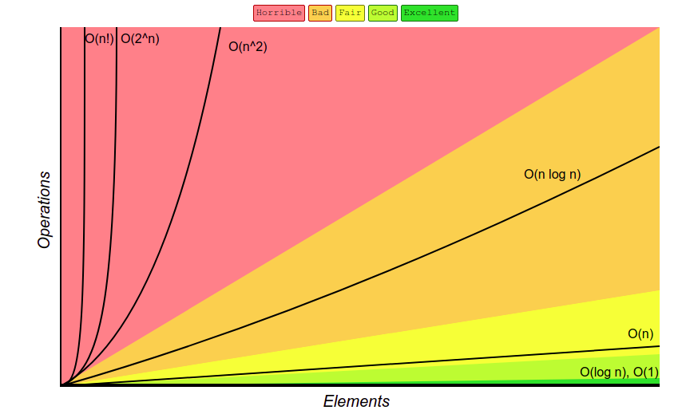

# Unscramble CS Problems

In this project, I deconstruct a series of open-ended problems into smaller components (e.g. inputs, outputs, series of functions).  

I will work on five tasks based on a fabricated set of calls and texts exchanged during September 2016.

## Data

The text and call data are provided in csv files.

The text data (text.csv) has the following columns: sending telephone number (string), receiving telephone number (string), timestamp of text message (string).  

The call data (call.csv) has the following columns: calling telephone number (string), receiving telephone number (string), start timestamp of telephone call (string), duration of telephone call in seconds (string).

## Efficiency
In this section, I analyze the time-complexity of the provided Python code.

### Complexity Chart

### Task 0
Prints out the information of first record of texts and last record of calls.

**Time Complexity**  
- get_first_text: 
- get_first_call: 

### Task 1
Prints number of distinct telephone numbers in the dataset.

**Time Complexity**  
- count_unique_numbers: 

### Task 2
Prints the phone number that spent the longest time on the phone and the total time in seconds they spend on phone call.

**Time Complexity**  
- get_most_active_number: 

### Task 3
Prints the phone codes called by fixed-line numbers in Bangalore and the percentage of calls from fixed lines in Bangalore that are to fixed lines in Bangalore.

**Time Complexity**  
- get_area_codes:  (not considering the for-loop for the print statement)
- get_bangalore_ratio: 

### Task 4
Prints the list of numbers that could be telemarketers.

**Time Complexity**  
- get_telemarketers :  (not considering the for-loop for the print statement)
